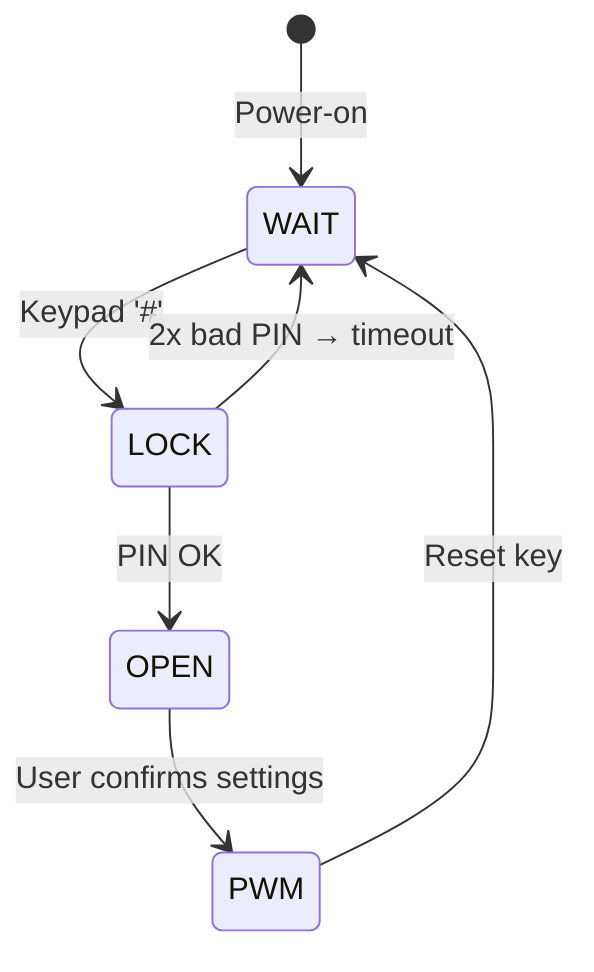

# 🔐 Safe‑Lock & Programmable PWM – TMS320F28335 Final Project

[](https://www.ti.com/product/TMS320F28335)
[](#building)
[](#building)

> **Course:** Micro‑Processors & Controllers (Afeka College, 2025)  
> **Author:** Yariv Shossberger

---

## 📑 Table of Contents
1. [Project Overview](#project-overview)  
2. [Hardware](#hardware)  
3. [Key Features](#key-features)  
4. [State Machine](#state-machine)  
5. [Peripherals](#peripherals)  
6. [Building & Flashing](#building--flashing)  
7. [Repository Layout](#repository-layout)  
8. [Acknowledgements](#acknowledgements)  

---

## Project Overview
This embedded application turns the **TI TMS320F28335 “Delfino” DSP** into a secure four‑digit *safe‑lock* that, upon successful unlock, lets the user **generate a square‑wave with any period (µs) and duty‑cycle (%).**

* Uses a **4×4 keypad** for numeric input  
* Provides feedback on a **16×2 LCD** and buzzer  
* Employs a **count‑down timer & lockout** after failed attempts  
* Re‑purposes **eCAP6 in APWM mode** to synthesise the requested output waveform  

---

## Hardware
| Block | Part | Notes |
|-------|------|-------|
| MCU | **TMS320F28335** (150 MHz C28x core) | Delfino Eval Board |
| Display | 16×2 LCD, 8‑bit parallel | HD44780‑compatible |
| Input | 4×4 matrix keypad | Rows → GPIO<XINTx> |
| Audio | Piezo buzzer | GPIO toggle on alerts |
| Wave output | eCAP6/APWM signal | SMA header on board |
| Timing | CPU Timer0 | 1.5 s ISR for countdown |

Schematic PDFs are in `/docs/` (board + LCD + timers).

---

## Key Features
* **Secure lock** – default PIN “7397”, **2 attempts**, 10 s lockout  
* **Menu flow** – LCD guides the user through states  
* **Programmable PWM** – set *Period* (µs) and *Duty* (%) via keypad  
* **Non‑blocking ISRs** – keypad (XINT3‑6), Timer0, and eCAP events  
* **Low‑level register control** – no driverlib, direct `ECAP6` & `GPIO` config  

---

## State Machine

* **WAIT** – idle banner on LCD  
* **LOCK** – prompt for 4‑digit PIN; buzzer + LCD on error  
* **OPEN** – configure PWM (*Period* › *Duty*)  
* **PWM** – eCAP6 runs; duty can be edited on‑the‑fly  

---

## Peripherals
| Module | Purpose | Config |
|--------|---------|--------|
| **GPIO** | Keypad, LEDs, buzzer | Inputs with pull‑ups, XINT3‑6 rising‑edge |
| **CPU‑Timer0** | Countdown 10 → 0 s | 1.5 s period, ISR decrements |
| **eCAP6** | APWM square‑wave | Period & Compare = user values |
| **SCI‑A** *(optional)* | Debug printf | 115 200 N81 |

---

## Building & Flashing
### Prerequisites
* **Code Composer Studio 12+** with *C2000ware*  
* XDS‑100 / XDS‑110 J‑TAG  
* `DSP2833x` header & linker files (already in `/include`)

### Steps
1. Import the project:
   * *Project → Import CCS Project →* select `Final_Project.c`  
2. Connect the Delfino board & target power.  
3. Build → *Debug* (F11). CCS will compile, load to SARAM, and run.  
4. Open a terminal on **SCI‑A** (optional) for runtime logs.

---

## Repository Layout
```
MicroCtrl_Final/
├── src/
│   └── Final_Project.c
├── include/          # DSP2833x headers & linker cmd
├── docs/             # PDFs: datasheet, timers, LCD, board
└── README.md
```

---

## Acknowledgements
* Texas Instruments **TMS320F28335** datasheet & *System Control and Interrupts Guide*  
* TI **Delfino F28335** Experimenter’s Kit (schematic)  
* HD44780 LCD command reference  

Project developed & tested on the Afeka College embedded lab benches (2025).
